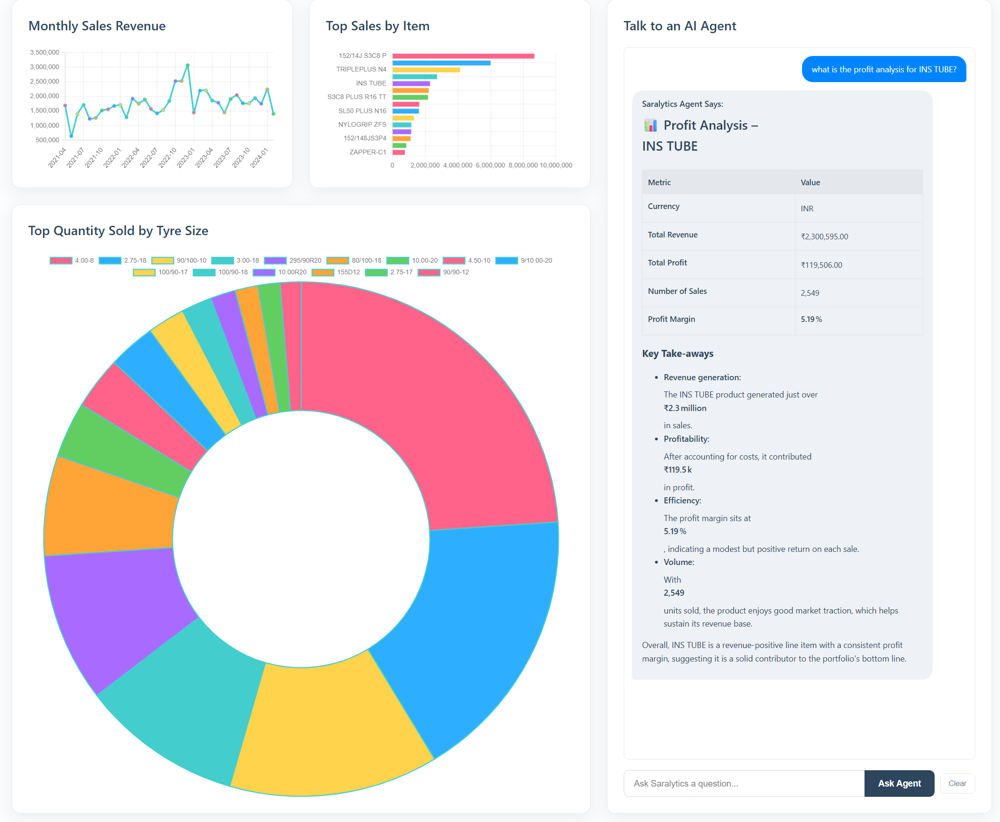
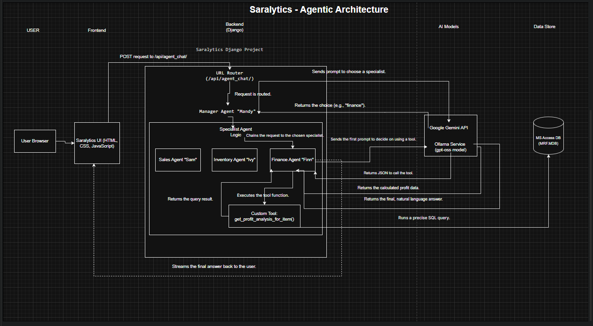

# Saralytics: The AI-Powered Business Analytics Dashboard

.png)

**Submission for the Kaggle 5-Day AI Agents Intensive Course Capstone Project**

**Video Demo:** [https://youtu.be/YfaQO-yYJSU](https://youtu.be/YfaQO-yYJSU)

---

## 1. Inspiration: The Story Behind Saralytics
**"Real Data, Real Business, Real Solutions."**

This project was born out of a specific, real-world need. My father operates a chain of tyre showrooms across India. Like many established businesses in the retail and distribution sector, his daily operations rely on a legacy ERP system backed by a Microsoft Access database.

I often watched him struggle to extract fast, specific insights from this massive amount of data. Simple questions like *"Which tyre brand gave us the highest margin last month?"* or *"Do we have enough stock of this specific MRF tyre size across all branches?"* required time-consuming manual lookups or requests to data entry staff.

**Saralytics** was built to solve this problem for him. It allows him to "chat" with his ERP system. It bridges the gap between legacy infrastructure (`.mdb` files) and modern AI capabilities, proving that AI agents can modernize even traditional family businesses.


*(The Saralytics Chat Interface interfacing with live ERP data)*

---

## 2. The Problem: The Data-Insight Gap
In today's data-rich world, businesses collect vast amounts of transactional data. However, for many SMEs (Small and Medium Enterprises), this data remains locked away in complex database tables, accessible only to technical staff.

Getting specific, role-relevant insights is a slow process. This "data-insight gap" forces decision-makers to rely on intuition rather than hard facts, simply because getting the facts takes too long.

---

## 3. The Solution: A Team of Specialized AI Agents
Saralytics is a web-based business analytics dashboard. Its core innovation is a **hierarchical multi-agent system** designed to mimic a real-world analytics department. Users interact with a single chat interface, but behind the scenes, a team of agents works together:

### The Agent Hierarchy
1.  **Mandy (The Manager):**
    *   **Role:** Top-level Orchestrator.
    *   **Engine:** **Google Gemini Pro**.
    *   **Function:** Mandy analyzes the user's intent and routes the task to the correct specialist. She ensures the user talks to the right expert for the job.

2.  **Sam (The Sales Agent):**
    *   **Role:** Revenue & Trends Specialist.
    *   **Focus:** Top-selling products, revenue per branch, and sales timestamps.

3.  **Ivy (The Inventory Agent):**
    *   **Role:** Stock & Product Specialist.
    *   **Focus:** Stock levels, unit counts, product categories, and low-stock alerts.

4.  **Finn (The Finance Agent):**
    *   **Role:** Profitability Specialist.
    *   **Tools:** Equipped with a custom Python tool to calculate precise profit margins from the legacy database.

---

## 4. Implementation & Architecture

### Tech Stack
*   **Frontend:** Vanilla HTML/CSS/JS with **Chart.js** for visualization and **Marked.js** for markdown rendering.
*   **Backend:** Django (Python).
*   **Database:** Legacy **Microsoft Access Database (`.MDB`)** connected via `pyodbc`.
*   **AI Models:** Hybrid approach using **Google Gemini** (Cloud) for routing and **Ollama** (Local LLM) for specialist reasoning.



### Key Features (Course Checklist)
This project successfully implements **5 of the key concepts** from the AI Agents Intensive course:

1.  ✅ **Multi-agent system:** A hierarchical architecture where a Manager agent delegates tasks to isolated Specialist agents based on domain expertise.
2.  ✅ **Agent powered by an LLM:** Utilization of **Google Gemini Pro** for high-intelligence routing and local LLMs for specialized tasks.
3.  ✅ **Custom Tools:** The Finance Agent (Finn) utilizes a custom Python function, `get_profit_analysis_for_item()`, demonstrating a full **Reason → Act → Observe** loop to query the database programmatically.
4.  ✅ **Sessions & Memory:** The chat system maintains session history. Context is passed back to the agents, allowing for multi-turn conversations (e.g., "How many did we sell?" followed by "And what was the profit on that?").
5.  ✅ **Observability:** The system implements detailed server-side logging (tracing), printing the Manager's routing logic and the Specialist's tool usage steps to the console for debugging and transparency.

---

## 5. Setup and Installation

**Note:** This project requires a Windows environment to natively support the Microsoft Access Database Engine.

1.  **Clone the repository:**
    ```bash
    git clone https://github.com/AkhileshwarReddySongala/saralytics.git
    ```

2.  **Prerequisites:**
    *   Python 3.11+
    *   **Microsoft Access Database Engine 2016 Redistributable** (Ensure bitness matches your Python installation).
    *   **Ollama** installed and running locally.

3.  **Environment Setup:**
    ```bash
    cd saralytics
    python -m venv venv
    .\venv\Scripts\activate
    pip install -r requirements.txt
    ```

4.  **API Configuration:**
    *   Create a `.env` file in the root directory.
    *   Add your Gemini API Key: `GEMINI_API_KEY="YOUR_KEY_HERE"`

5.  **Database Setup:**
    *   *Privacy Note:* The real ERP database contains sensitive family business data.
    *   To run this, place a sample Microsoft Access file named `MRF.MDB` in the project root, or update the `DB_PATH` in `views.py` to point to your own `.mdb` file.

6.  **Run the Server:**
    ```bash
    python manage.py runserver
    ```

---

## 6. Bonus: Effective Use of Gemini
I utilized **Google Gemini Pro** specifically for the **Manager Agent (Mandy)** because of its superior reasoning and instruction-following capabilities regarding intent classification.

In a multi-agent system, the router is the single point of failure; if the router fails, the wrong specialist answers, and the answer is wrong. Gemini proved to be faster and more accurate than smaller local models at discerning the subtle differences between a "Sales" query and a "Finance" query, ensuring the system remains robust.
